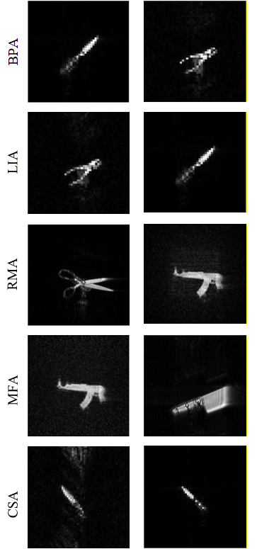

# differentiable-sar-imaging-algos

This repository contains MATLAB implementations of classical SAR imaging algorithms reformulated as differentiable operators for gradient-based optimization. The project focuses on making standard image formation methods such as matched-filter algorithm (MFA), range-migration algorithm (RMA), back-projection algorithm (BPA), light-weigth algorithm (LIA), and compressed sensing algorithm (CSA) differentiable so gradients can be propagated through the reconstruction pipeline and used with loss-driven optimization. In this work, the imaging process is treated as part of an end-to-end optimization framework rather than only a fixed reconstruction step.
***
#### Near-field SAR image generated using differential algorithms

  

***
#### Dataset availability 
Note: Raw SAR data is not included in this repository due to GitHub size limits. Please email me at ldorje1@binghamton.edu if you need access to the dataset.
